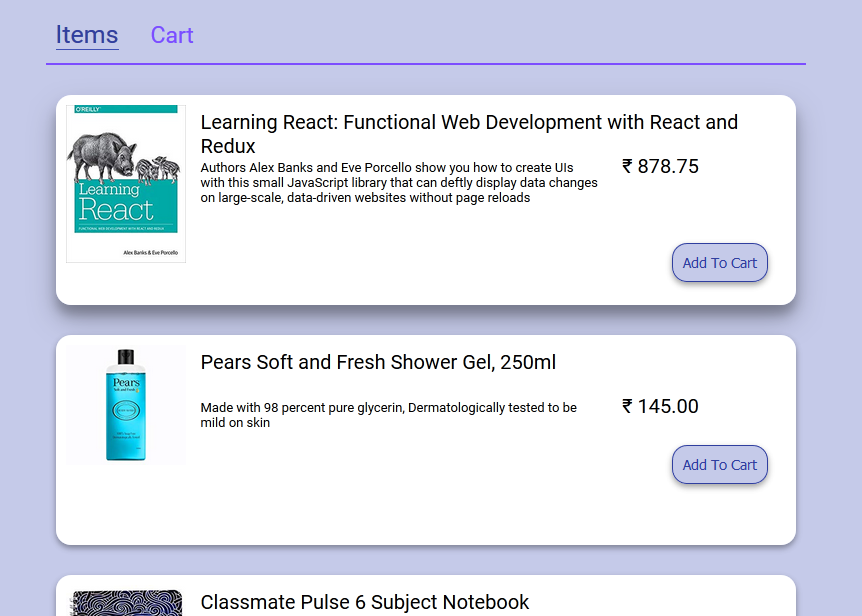
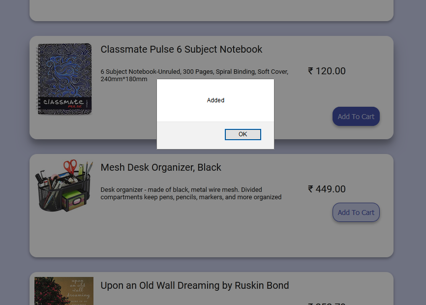
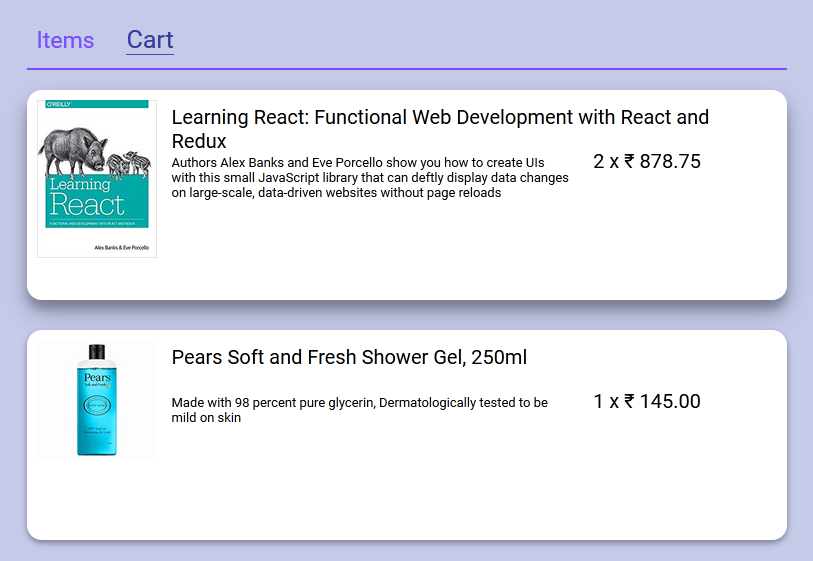

# Shopping Cart using React

This is a basic shopping cart which takes in a sample data in JSON format, displays it and enables the user to add items to the cart. To know more about the development process and what I learned in this project, please see this supplementary [blog post](https://rajrajhans.com/shopping-cart-with-react/)

Here are some screenshots -

## Blog Post 

To know more about this project, please read the blog post accompanying it - [Building a basic Shopping Cart with React](https://rajrajhans.com/shopping-cart-with-react/).  

## Running the project

This project was bootstrapped with [Create React App](https://github.com/facebook/create-react-app).

In the project directory, you can run:

#### `npm start`

Runs the app in the development mode. 
Open [http://localhost:3000](http://localhost:3000) to view it in the browser.

The page will reload if you make edits. 
You will also see any lint errors in the console.

#### `npm run build`

Builds the app for production to the `build` folder. 
It correctly bundles React in production mode and optimizes the build for the best performance.

The build is minified and the filenames include the hashes. 
Your app is ready to be deployed!
